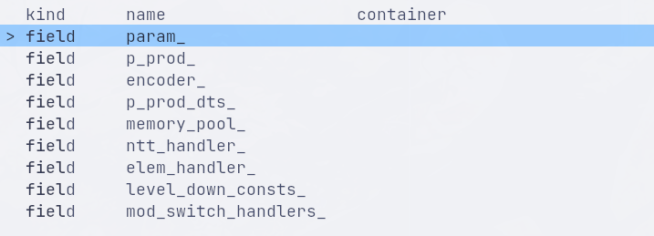
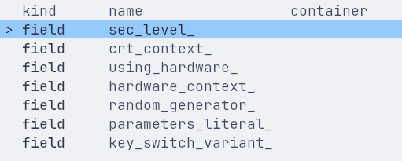
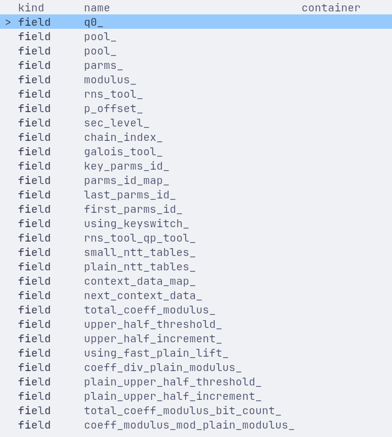

这是一个Poseidon的GPU模块设计文档，内部包含Poseidon的Context/Evaluator设计、多卡设计以及算法设计等等。

# Poseidon与Cheddar整体结构回顾
整体而言，两者都有一个Context，这个Context中包含了执行CKKS所需的各种数据和工具。但是相对而言，Poseidon的Context没有Cheddar的Context那么集中。

Cheddar中的Context包含如下内容：



Cheddar的ntt_handler_、elem_handler_会在Context的高层操作中接收device view，并在handler内部launch对应的CUDA kernel。
相比较下，Poseidon的方式更加类似于SEAL，执行入口不在Context中，而是在Evaluator中。

Poseidon的Context Field如下图所示：



下面是Context中的一个实例，CrtContext



可以发现，Poseidon的Context基本不承载执行模块，主要保存参数和工具。具体执行发生在Evaluator中，
Evaluator会调用context获取上下文，并进一步调用rns_poly执行实际的加减等操作。

``` cpp
void EvaluatorCkksBase::add_inplace(poseidon::Ciphertext &ciph1,
                                    const poseidon::Ciphertext &ciph2) const
{
    // Verify parameters.
    ...

    auto &context_data = *context_.crt_context()->get_context_data(ciph1.parms_id());
    auto &parms = context_data.parms();
    size_t coeff_count = parms.degree();
    size_t ciph1_size = ciph1.size();
    size_t ciph2_size = ciph2.size();
    size_t max_count = max(ciph1_size, ciph2_size);
    size_t min_count = min(ciph1_size, ciph2_size);

    // Size check
    ...

    // Prepare result
    ciph1.resize(context_, context_data.parms().parms_id(), max_count);
    // Add ciphs
    for (auto i = 0; i < min_count; i++)
    {
        // 由于索引返回的是rns_poly，因此这里的add调用的是rns的方法
        ciph1[i].add(ciph2[i], ciph1[i]);
    }

    // Copy the remaining polys of the array with larger count into ciph1
    if (ciph1_size < ciph2_size)
    {
        for (auto i = min_count; i < max_count; ++i)
        {
            ciph1[i].copy(ciph2[i]);
        }
    }
}
```

除此之外，Ciphertext的定义也有很大的差别

当前Poseidon软件路径中的数据主要保存在CPU/host内存中，因此Poseidon中的Ciphertext可以直接存储需要的数据
``` cpp
    mutable std::size_t coeff_modulus_size_ = 0;

    double scale_ = 1.0;

    std::uint64_t correction_factor_ = 1;

    DynArray<ct_coeff_type> data_;
    vector<RNSPoly> polys_;

    std::shared_ptr<CrtContext> crt_context_{nullptr};
```

在Cheddar中则不是这样。Cheddar的密文对象拥有GPU device memory，计算时主要传递由DeviceVector生成的view；这些view可以理解为带有size/aux信息的device pointer引用，真正的计算由handler在GPU kernel中完成。
``` cpp
  using Dv = DeviceVector<word>;
  using Ct = Ciphertext<word>;
  using Pt = Plaintext<word>;
  using Evk = EvaluationKey<word>;
  using Const = Constant<word>;

  class Ciphertext : public Container<word> {
 private:
  using Base = Container<word>;
  int num_slots_ = Base::degree_ / 2;

 public:
  /**
   * @brief Construct a new Ciphertext object.
   *
   * @param num_primes the NPInfo for the Ciphertext
   * @param has_rx whether the ciphertext has the third polynomial rx (default:
   * false)
   */
  explicit Ciphertext(const NPInfo &num_primes = NPInfo{}, bool has_rx = false);

  // movable, but not copyable
  Ciphertext(Ciphertext &&) = default;
  Ciphertext &operator=(Ciphertext &&) = default;

  virtual ~Ciphertext() = default;

  // member variables (public)
  DeviceVector<word> bx_;
  DeviceVector<word> ax_;
  DeviceVector<word> rx_;

  // view functions (implementation details)
  DvView<word> BxView(int np_front_ignore = 0);
  DvConstView<word> BxConstView(int np_front_ignore = 0) const;
  DvView<word> AxView(int np_front_ignore = 0);
  DvConstView<word> AxConstView(int np_front_ignore = 0) const;
  DvView<word> RxView(int np_front_ignore = 0);
  DvConstView<word> RxConstView(int np_front_ignore = 0) const;
  std::vector<DvView<word>> ViewVector(int np_front_ignore = 0,
                                       bool ignore_rx = false);
  std::vector<DvConstView<word>> ConstViewVector(int np_front_ignore = 0,
                                                 bool ignore_rx = false) const;
}
```
这里面的核心数据结构是`DeviceVector`、`DvConstView`、`DvView`。
其中`DeviceVector`对GPU数据有所有权，而另外两个可以通过`DeviceVector`获取到轻量引用。

``` cpp
class DeviceVector : public rmm::device_uvector<word> {
 private:
  using Base = rmm::device_uvector<word>;
  using Base::resize;

 public:
  // A constructor without initilization.
  explicit DeviceVector(int size = 0, cudaStream_t stream = cudaStreamLegacy);

  ...

  /**
   * @brief Provides a view of the device vector.
   *
   * @param aux_size auxiliary part size (semantic information)
   * @param front_offset offset-part not accessible from the view
   * @return DvView<word> the view of the device vector
   */
  DvView<word> View(int aux_size = 0, int front_offset = 0);

  /**
   * @brief Provides a read-only view of the device vector.
   *
   * @param aux_size auxiliary part size (semantic information)
   * @param front_offset offset-part not accessible from the view
   * @return DvConstView<word> the read-only view of the device vector
   */
  DvConstView<word> ConstView(int aux_size = 0, int front_offset = 0) const;
}
```

这与Poseidon当前的内存模型假设有很大的不一致。

***强行复用Poseidon当前的主机侧数据结构，可能会导致CPU与GPU之间产生巨大的传输开销。因此，有必要为GPU单独设计一套类似Cheddar的device-resident架构。***

# 结构设计概述
回顾Poseidon整体结构，可以发现，以Evaluator为切入点是个可行的方案。
Poseidon中，Evaluator是Context等内容的高层封装：
``` cpp
    virtual void ntt_fwd(const Plaintext &plain, Plaintext &result,
                         parms_id_type parms_id = parms_id_zero) const override;
    virtual void ntt_fwd(const Ciphertext &ciph, Ciphertext &result) const override;
    virtual void ntt_inv(const Ciphertext &ciph, Ciphertext &result) const override;

    virtual void sub_plain(const Ciphertext &ciph, const Plaintext &plain,
                           Ciphertext &result) const override;

    virtual void add_plain(const Ciphertext &ciph, const Plaintext &plain,
                           Ciphertext &result) const override;
    virtual void add(const Ciphertext &ciph1, const Ciphertext &ciph2,
                     Ciphertext &result) const override;
    virtual void sub(const Ciphertext &ciph1, const Ciphertext &ciph2,
                     Ciphertext &result) const override;
    virtual void multiply(const Ciphertext &ciph1, const Ciphertext &ciph2,
                          Ciphertext &result) const override;
    virtual void square_inplace(Ciphertext &ciph,
                                MemoryPoolHandle pool = MemoryManager::GetPool()) const override;

    virtual void relinearize(const Ciphertext &ciph1, Ciphertext &result,
                             const RelinKeys &relin_keys) const override;

    virtual void multiply_relin(const Ciphertext &ciph1, const Ciphertext &ciph2,
                                Ciphertext &result, const RelinKeys &relin_keys) const override;

    virtual void rotate(const Ciphertext &ciph, Ciphertext &result, int step,
                        const GaloisKeys &galois_keys) const override;
    virtual void rotate_row(const Ciphertext &ciph, Ciphertext &result, int step,
                            const GaloisKeys &galois_keys) const override;
```

通过实现高层Evaluator类，我们能够在尽量不大改现有结构的前提下，实现GPU相关功能。

然而，这其中也存在一定的问题：Ciphertext、GaloisKeys等不能直接通用，我们需要进一步对其封装。这是因为，
原先对Ciphertext等的假设是数据在主机内存中，但是现在这个假设不再成立。我们需要支持GPU甚至GPU多卡，因此Ciphertext等需要抽象出来，
不再是原先的接口。

因此对Evaluator也需要一层额外封装，具体可能类似以下代码：
``` cpp
// AbstractEvaluator

virtual void add(const AbstractCiphertext &ciph, const AbstractCiphertext &ciph2, AbstractCiphertext &result) const;
```
