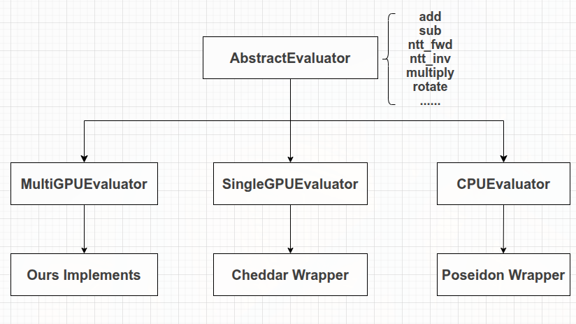
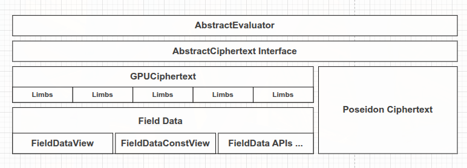

这是一个Poseidon的GPU模块设计文档，内部包含Poseidon的Context/Evaluator设计、多卡设计以及算法设计等等。

# Poseidon与Cheddar整体结构回顾
整体而言，两者都有一个Context，这个Context中包含了执行CKKS所需的各种数据和工具。但是相对而言，Poseidon的Context没有Cheddar的Context那么集中。

Cheddar中的Context包含如下内容：


Cheddar的ntt_handler_、elem_handler_会在Context的高层操作中接收device view，并在handler内部launch对应的CUDA kernel。
相比较下，Poseidon的方式更加类似于SEAL，执行入口不在Context中，而是在Evaluator中。

Poseidon的Context Field如下图所示：


下面是Context中的一个实例，CrtContext


可以发现，Poseidon的Context基本不承载执行模块，主要保存参数和工具。具体执行发生在Evaluator中，
Evaluator会调用context获取上下文，并进一步调用rns_poly执行实际的加减等操作。

``` cpp
void EvaluatorCkksBase::add_inplace(poseidon::Ciphertext &ciph1,
                                    const poseidon::Ciphertext &ciph2) const
{
    // Verify parameters.
    ...

    auto &context_data = *context_.crt_context()->get_context_data(ciph1.parms_id());
    auto &parms = context_data.parms();
    size_t coeff_count = parms.degree();
    size_t ciph1_size = ciph1.size();
    size_t ciph2_size = ciph2.size();
    size_t max_count = max(ciph1_size, ciph2_size);
    size_t min_count = min(ciph1_size, ciph2_size);

    // Size check
    ...

    // Prepare result
    ciph1.resize(context_, context_data.parms().parms_id(), max_count);
    // Add ciphs
    for (auto i = 0; i < min_count; i++)
    {
        // 由于索引返回的是rns_poly，因此这里的add调用的是rns的方法
        ciph1[i].add(ciph2[i], ciph1[i]);
    }

    // Copy the remaining polys of the array with larger count into ciph1
    if (ciph1_size < ciph2_size)
    {
        for (auto i = min_count; i < max_count; ++i)
        {
            ciph1[i].copy(ciph2[i]);
        }
    }
}
```

除此之外，Ciphertext的定义也有很大的差别

当前Poseidon软件路径中的数据主要保存在CPU/host内存中，因此Poseidon中的Ciphertext可以直接存储需要的数据
``` cpp
    mutable std::size_t coeff_modulus_size_ = 0;

    double scale_ = 1.0;

    std::uint64_t correction_factor_ = 1;

    DynArray<ct_coeff_type> data_;
    vector<RNSPoly> polys_;

    std::shared_ptr<CrtContext> crt_context_{nullptr};
```

在Cheddar中则不是这样。Cheddar的密文对象拥有GPU device memory，计算时主要传递由DeviceVector生成的view；这些view可以理解为带有size/aux信息的device pointer引用，真正的计算由handler在GPU kernel中完成。
``` cpp
  using Dv = DeviceVector<word>;
  using Ct = Ciphertext<word>;
  using Pt = Plaintext<word>;
  using Evk = EvaluationKey<word>;
  using Const = Constant<word>;

  class Ciphertext : public Container<word> {
 private:
  using Base = Container<word>;
  int num_slots_ = Base::degree_ / 2;

 public:
  /**
   * @brief Construct a new Ciphertext object.
   *
   * @param num_primes the NPInfo for the Ciphertext
   * @param has_rx whether the ciphertext has the third polynomial rx (default:
   * false)
   */
  explicit Ciphertext(const NPInfo &num_primes = NPInfo{}, bool has_rx = false);

  // movable, but not copyable
  Ciphertext(Ciphertext &&) = default;
  Ciphertext &operator=(Ciphertext &&) = default;

  virtual ~Ciphertext() = default;

  // member variables (public)
  DeviceVector<word> bx_;
  DeviceVector<word> ax_;
  DeviceVector<word> rx_;

  // view functions (implementation details)
  DvView<word> BxView(int np_front_ignore = 0);
  DvConstView<word> BxConstView(int np_front_ignore = 0) const;
  DvView<word> AxView(int np_front_ignore = 0);
  DvConstView<word> AxConstView(int np_front_ignore = 0) const;
  DvView<word> RxView(int np_front_ignore = 0);
  DvConstView<word> RxConstView(int np_front_ignore = 0) const;
  std::vector<DvView<word>> ViewVector(int np_front_ignore = 0,
                                       bool ignore_rx = false);
  std::vector<DvConstView<word>> ConstViewVector(int np_front_ignore = 0,
                                                 bool ignore_rx = false) const;
}
```
这里面的核心数据结构是`DeviceVector`、`DvConstView`、`DvView`。
其中`DeviceVector`对GPU数据有所有权，而另外两个可以通过`DeviceVector`获取到轻量引用。

``` cpp
class DeviceVector : public rmm::device_uvector<word> {
 private:
  using Base = rmm::device_uvector<word>;
  using Base::resize;

 public:
  // A constructor without initilization.
  explicit DeviceVector(int size = 0, cudaStream_t stream = cudaStreamLegacy);

  ...

  /**
   * @brief Provides a view of the device vector.
   *
   * @param aux_size auxiliary part size (semantic information)
   * @param front_offset offset-part not accessible from the view
   * @return DvView<word> the view of the device vector
   */
  DvView<word> View(int aux_size = 0, int front_offset = 0);

  /**
   * @brief Provides a read-only view of the device vector.
   *
   * @param aux_size auxiliary part size (semantic information)
   * @param front_offset offset-part not accessible from the view
   * @return DvConstView<word> the read-only view of the device vector
   */
  DvConstView<word> ConstView(int aux_size = 0, int front_offset = 0) const;
}
```

这与Poseidon当前的内存模型假设有很大的不一致。

***强行复用Poseidon当前的主机侧数据结构，可能会导致CPU与GPU之间产生巨大的传输开销。因此，有必要为GPU单独设计一套类似Cheddar的device-resident架构。***

# 结构设计概述
回顾Poseidon整体结构，可以发现，以Evaluator为切入点是个可行的方案。Poseidon中，Evaluator是Context等内容的高层封装：
``` cpp
    virtual void ntt_fwd(const Plaintext &plain, Plaintext &result,
                         parms_id_type parms_id = parms_id_zero) const override;
    virtual void ntt_fwd(const Ciphertext &ciph, Ciphertext &result) const override;
    virtual void ntt_inv(const Ciphertext &ciph, Ciphertext &result) const override;

    virtual void sub_plain(const Ciphertext &ciph, const Plaintext &plain,
                           Ciphertext &result) const override;

    virtual void add_plain(const Ciphertext &ciph, const Plaintext &plain,
                           Ciphertext &result) const override;
    virtual void add(const Ciphertext &ciph1, const Ciphertext &ciph2,
                     Ciphertext &result) const override;
    virtual void sub(const Ciphertext &ciph1, const Ciphertext &ciph2,
                     Ciphertext &result) const override;
    virtual void multiply(const Ciphertext &ciph1, const Ciphertext &ciph2,
                          Ciphertext &result) const override;
    virtual void square_inplace(Ciphertext &ciph,
                                MemoryPoolHandle pool = MemoryManager::GetPool()) const override;

    virtual void relinearize(const Ciphertext &ciph1, Ciphertext &result,
                             const RelinKeys &relin_keys) const override;

    virtual void multiply_relin(const Ciphertext &ciph1, const Ciphertext &ciph2,
                                Ciphertext &result, const RelinKeys &relin_keys) const override;

    virtual void rotate(const Ciphertext &ciph, Ciphertext &result, int step,
                        const GaloisKeys &galois_keys) const override;
    virtual void rotate_row(const Ciphertext &ciph, Ciphertext &result, int step,
                            const GaloisKeys &galois_keys) const override;
```

因此，GPU模块不应直接替换Poseidon当前的`EvaluatorBase`，而应在其上方新增一层更高层的执行接口。这样可以保留现有软件路径，同时让GPU路径有机会使用完全不同的内存模型和执行模型。

核心问题是，`Ciphertext`、`Plaintext`、`RelinKeys`、`GaloisKeys`等对象不能在CPU、单卡GPU、多卡GPU之间直接通用。当前Poseidon对象默认承载主机侧数据，而GPU路径需要device-resident数据。只把Evaluator换成GPU实现是不够的，数据对象、密钥对象、内存域以及布局元信息都需要被显式建模。

因此，这里引入独立的`AbstractEvaluator`接口。它不是现有`EvaluatorBase`的子类，而是面向不同后端的上层包装：
``` cpp
// AbstractEvaluator

virtual void add(const AbstractCiphertext &ciph, const AbstractCiphertext &ciph2, AbstractCiphertext &result) const;
```

上面的代码只是示意。完整接口不应只抽象`Ciphertext`，还需要对应的`AbstractPlaintext`、`AbstractRelinKeys`、`AbstractGaloisKeys`等类型，或者在第一阶段明确只支持一个很小的CKKS运算子集。

总体而言，结构如下图所示：



`AbstractEvaluator`下有多个后端实现：

- `CPUEvaluator`：对现有Poseidon软件路径的适配层。它只接受host layout的数据，内部调用原有`EvaluatorBase`。
- `SingleGPUEvaluator`：对单卡GPU执行路径的适配层。第一阶段可以包装Cheddar，后续考虑优化实现。
- `MultiGPUEvaluator`：面向多卡的自研执行路径。它需要先定义分布式数据布局，再实现具体算子，不能只依赖单卡Cheddar wrapper自然扩展。

每个后端都应该声明自己的能力边界，例如支持的scheme、数据域、密文布局、key布局和word width。当输入数据不满足后端能力要求时，应该显式报错，而不是在运算过程中隐式搬运或隐式转换。

## AbstractCiphertext设计
`AbstractCiphertext`不能只表示“数据在哪里”。对FHE对象来说，位置只是其中一部分。一个可用的抽象至少需要同时描述以下内容：

- 密文元数据：scheme、`parms_id`、level或NPInfo、scale、correction factor、是否为NTT形式、密文多项式个数、slot数量等。
- 内存域：host内存、某张GPU的device memory，或者多卡分布式内存。
- 数据布局：RNS prime排列方式、多项式组件排列方式、是否存在aux/P primes、是否与Cheddar或Poseidon原生布局兼容。
- 生命周期：对象是否拥有数据，view是否只是临时借用，resize或跨域迁移后已有view是否失效。

抽象设计的核心目标是把数据的“格式”和“位置”都变成显式状态。跨域传输不应该隐藏在`add`、`multiply`这类算子内部。默认规则应当是：二元运算两端的数据必须位于同一后端支持的内存域和布局中；如果不满足条件，算子直接返回错误或抛异常。跨域复制通过单独的API完成，例如`copy_to(domain)`或`TransferManager::copy(src, dst_domain)`。

这个规则与Cheddar并不冲突。Cheddar本身也把`HostVector`和`DeviceVector`区分为不同的数据对象，device侧计算只接受device-resident对象或view。我们可以参考Cheddar的`DeviceVector`/`DvView`模式，但需要额外补充域标记和跨域复制策略。至于RNS prime如何排列、密文组件如何组织、哪些数据分布在哪些卡上，应由`Ciphertext`、`Plaintext`、key等更高层对象负责，而不是由底层buffer负责。



## 统一逻辑对象与互斥Storage
为了保留统一API，可以把`Ciphertext`设计成一个逻辑句柄。它的元数据保存在外层，实际物理数据通过类似Rust enum的互斥storage承载。在C++中可以用`std::variant`表达：

``` cpp
using CiphertextStorage = std::variant<
    HostCiphertextStorage,
    CudaCiphertextStorage,
    DistributedCiphertextStorage
>;

class Ciphertext {
    CiphertextMeta meta;
    CiphertextStorage storage;
};
```

这种设计下，同一个`Ciphertext`对象在任意时刻只拥有一种物理表示，避免同时维护host副本和GPU副本带来的一致性问题。它仍然可以通过统一API传给不同的Evaluator，但Evaluator在执行前必须检查当前`storage`是否满足自己的后端能力要求。如果不满足，应要求调用者显式转换，而不是在算子内部隐式搬运。

这里“统一”的是逻辑API和对象入口，而不是让所有Evaluator都自动消费所有物理storage。storage的实际类型仍然是显式、可检查、互斥的。

跨域转换可以提供两类API：

``` cpp
Ciphertext gpu_ct = ct.to_cuda(device_id); // 返回一个新对象
ct.to_cuda_inplace(device_id);             // 原地替换storage
```

`to_*`接口应该被视为显式的数据传输或布局转换边界。转换后，旧storage是否保留、是否失效、是否需要同步，都应由接口语义明确规定。第一阶段建议采用互斥storage，即原地转换会替换旧storage，不维护多份缓存。

## Metadata与Device参数
`CiphertextMeta`应放在外层`Ciphertext`中，作为host-side的权威元数据。它包含`parms_id`、scale、level或NPInfo、`is_ntt_form`、component数量、slot数量、layout id等信息。这些信息主要服务于CPU侧调度、类型检查、后端能力判断、kernel选择和输出对象尺寸计算。

GPU kernel通常不需要完整的`CiphertextMeta`。执行时应由Evaluator或GPU Context根据host-side meta和storage layout派生出轻量的device-side view或kernel参数，例如：

``` cpp
struct CudaCiphertextView {
    std::vector<ComponentView> components;
    CudaLayoutView layout;
    CudaKernelParams params;
};
```

`CudaKernelParams`只应包含kernel真正需要的字段，例如degree、prime数量、stride、component数量、aux offset、modulus table指针、NTT table指针等。scale、`parms_id`这类主要用于调度和校验的字段通常不需要原样复制进GPU kernel。

元数据更新也应由host-side Evaluator负责。例如rescale后，GPU kernel负责生成新的系数数据，Evaluator负责在host权威`CiphertextMeta`中更新level和scale。不要让GPU storage维护第二套权威metadata，否则host/device之间会出现额外同步和一致性问题。

## 内存域与FieldData
`FieldData`可以作为底层buffer owner，定位类似Cheddar的`DeviceVector`。它只负责描述“一段数据”和“这段数据所在的内存域”，不负责解释这段数据在FHE语义上代表哪个RNS prime、哪个密文组件、哪一段aux区域。换句话说，`FieldData`应该是无FHE语义的内存抽象。

`FieldData`需要保存的运行时信息包括：

- `domain`：数据所在域，例如`Host`、`CudaDevice{id}`、`Distributed{shards}`。
- `size/capacity`：实际元素数量与容量。
- `stream/event`语义：异步拷贝和kernel launch需要明确同步边界。

`FieldData`拥有数据，并可以按需生成`FieldDataView`和`FieldDataConstView`。这些view只是短生命周期borrow，不拥有内存，也不延长`FieldData`生命周期。任何`resize`、释放、跨域迁移、重新分配都会使旧view失效。因此，view不应长期保存在密文对象中，只应在调用kernel或handler前临时生成。

跨域复制不应该进入`FieldData`内部。更清晰的职责划分是：`FieldData`描述并拥有buffer，`TransferManager`或`DomainRuntime`负责根据源域、目标域、stream和设备拓扑执行拷贝。这样后续支持host staging、P2P、NVLink或多卡同步时，不需要让每个buffer owner知道所有传输策略。这种传输可以是运行时的，也可以是提前规划好的。

## GPUCiphertext的所有权模型
`GPUCiphertext`应该是拥有型对象。它内部应持有由`FieldData`组成的storage描述，而不是持有`FieldDataView`或`FieldDataConstView`。view类型只适合作为临时参数，不适合作为密文的长期成员。

密文数据至少需要拆成三层维度来描述：

- component：密文组件，例如CKKS中的`c0/c1/c2`，Cheddar中对应`bx_/ax_/rx_`。
- RNS limb：某个component在某个RNS prime下的一整个多项式数据。
- coefficient：某个RNS limb中的具体多项式系数，下标范围为`0..N-1`。

Poseidon当前的`vector<RNSPoly> polys_`实际上更接近component列表，而不是RNS limb列表。每个`RNSPoly`内部才保存多个RNS prime下的数据。Cheddar的`bx_`、`ax_`、`rx_`也可以按类似方式理解：它们是密文组件，每个组件内部连续存放若干prime的数据。

因此，`FieldData`不应直接等价于“一个RNS limb”。它只是若干逻辑limb在某个内存域中的物理承载。解释这些`FieldData`分别对应哪些component、哪些RNS prime、哪些coefficient range，应该由component级别的storage或layout metadata完成。

单卡版本可以先设计为：

``` cpp
struct ComponentStorage {
    std::vector<FieldData> shards;
    ComponentLayout layout;
};

class GPUCiphertext {
    CiphertextMeta meta;
    std::vector<ComponentStorage> components; // c0, c1, c2...
};
```

在单卡情况下，`ComponentStorage`可以非常简单：通常只包含一个`FieldData`，这个`FieldData`连续存放该component的所有RNS limbs，`ComponentLayout`记录prime顺序、degree、aux区域等解释方式。这样设计比直接使用`std::vector<FieldData> components`多了一层结构，但能明确表达“component拥有布局语义，FieldData只负责内存”。

当进入多卡设计后，一个component不一定还能对应一个`FieldData`。例如采用按RNS prime切分的多卡布局时，一个CKKS密文可以被表示为：

``` text
c0:
  q0-q3 -> FieldData on GPU0
  q4-q7 -> FieldData on GPU1

c1:
  q0-q3 -> FieldData on GPU0
  q4-q7 -> FieldData on GPU1
```

这时`ComponentStorage`负责描述“逻辑component/RNS区间”到“物理FieldData shard”的映射。也就是说，`ComponentStorage`是component语义和物理内存之间的桥；`FieldData`仍然保持无FHE语义，只知道自己在哪个域、大小是多少、如何生成view。

如果需要非持有视图，应单独设计`GPUCiphertextView`：

``` cpp
class GPUCiphertextView {
    CiphertextMeta meta;
    std::vector<ComponentView> components;
};
```

这样可以明确区分“拥有数据的密文”和“临时传给kernel的密文视图”，避免由于数据移动或重新分配导致view悬垂。

## 后端适配约束
`CPUEvaluator`、`SingleGPUEvaluator`和`MultiGPUEvaluator`可以共享同一套`AbstractEvaluator` API，但它们不应该对任意物理storage做隐式处理。更稳妥的设计是：统一API保留在逻辑对象层，后端执行时只接受自己声明支持的storage类型和布局。

- `CPUEvaluator`要求输入的`CiphertextStorage`为`HostCiphertextStorage`，或已经显式转换为可映射到Poseidon原生`Ciphertext`的host layout。
- `SingleGPUEvaluator`要求输入的`CiphertextStorage`为`CudaCiphertextStorage`，并要求其layout可以映射到Cheddar的`Ciphertext<word>`或本项目自己的单卡GPU layout。
- `MultiGPUEvaluator`要求输入的`CiphertextStorage`为`DistributedCiphertextStorage`，并要求其分布式切分策略与当前算子匹配。

如果未来需要在一个表达式中混合CPU和GPU数据，应在表达式执行前显式插入复制或转换步骤，而不是让算子内部偷偷搬运数据。这样用户侧仍然使用统一的`evaluator.add(a, b, out)`形式，但数据placement和转换成本不会被隐藏。

## 多卡设计的待定问题
目前`MultiGPUEvaluator`仍然只是架构占位。真正实现前，必须先确定分布式密文的切分维度。可能的切分方式包括：

- 按batch或多个密文切分：实现简单，但单个大密文的单算子并行度有限。
- 按RNS prime切分：适合部分逐prime算子，但key switching、rescale、base conversion会引入跨卡通信。（这是目前主要考虑的布局）
- 按poly component切分：对部分线性算子简单，但乘法、重线性化和旋转会产生组件间依赖。
- 按coefficient切分：对NTT和rotation通信压力较大，通常需要更复杂的通信计划。

在没有确定切分策略之前，`DistributedCiphertext`只应作为接口预留。


