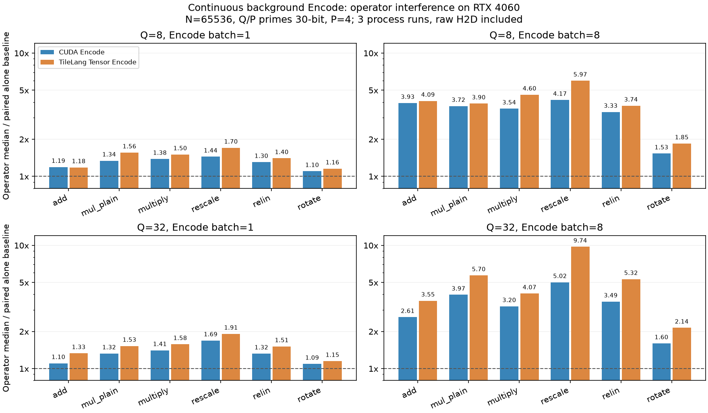
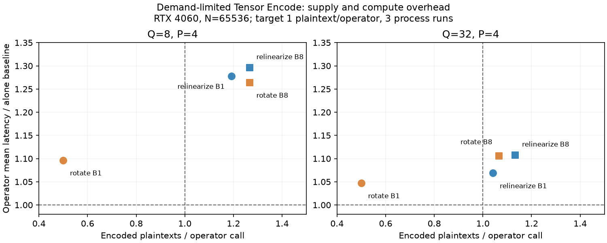

# GPU Encode 与主计算并发测量（2026-10-11）

RTX 4060 Laptop、N=65536、Q=8/32、P=4、30-bit primes、scale=2^40、64 MiB 初始 RMM pool。主算子使用真实 GpuEvaluator API，NTT 选择 CUDA four-step。后台是完整 GPU Encode（pinned 原始数据 H2D、FP64 cuFFT、RNS 展开、CUDA 或 TileLang Tensor NTT）。初始化、密钥/操作数上传不计时，API 内部 scratch 和分配计时。参数用于算术实验（sec_level_none）。这里只测本机；188Server 此次连接未成功。

重点是前台算子 slowdown 和后台供给率。二者来自同一 GPU 上的两条 CUDA per-thread streams，默认优先级；线程内创建 FFT plans。CUDA 查询得到 stream IDs 13/14，全部进程均检查 IDs 不同。两条路径共享 SM、cache、memory bandwidth，也共享主机提交资源；单独 Encode 足够快不能直接推出并发零减速。

每配置 3 个进程，每次 30 个样本，每样本重复调用算子 4 次。前台及后台各预热 >=100 ms GPU event 时间。每个算子的两次独立运行基线夹住后台实验；后台顺序打乱。CUDA events 包含 CPU 提交间隙，wall 也记录。表中是每个进程统计量的中位数。未锁 GPU 时钟，不能把这些数据当作纯硬件算术吞吐。

## 持续满负荷后台 Encode

`repeated/` 的 12 份正式报告基于 `6eba292b`。下表是主算子的中位数 slowdown（1× 表示与独立运行一样）；两次基线中位数取平均作为每进程分母。

| Q | Encode batch | 算子 | CUDA Encode slowdown | Tensor Encode slowdown | Tensor 产出（份/算子） |
| ---: | ---: | --- | ---: | ---: | ---: |
| 8 | 1 | add | 1.19× | 1.18× | 0.08 |
| 8 | 1 | multiply_plain | 1.34× | 1.56× | 0.11 |
| 8 | 1 | multiply | 1.38× | 1.50× | 0.14 |
| 8 | 1 | rescale | 1.44× | 1.70× | 0.74 |
| 8 | 1 | relinearize | 1.30× | 1.40× | 2.00 |
| 8 | 1 | rotate | 1.10× | 1.16× | 0.75 |
| 8 | 8 | add | 3.93× | 4.09× | 0.47 |
| 8 | 8 | multiply_plain | 3.72× | 3.90× | 0.53 |
| 8 | 8 | multiply | 3.54× | 4.60× | 0.80 |
| 8 | 8 | rescale | 4.17× | 5.97× | 3.67 |
| 8 | 8 | relinearize | 3.33× | 3.74× | 12.00 |
| 8 | 8 | rotate | 1.53× | 1.85× | 4.00 |
| 32 | 1 | add | 1.10× | 1.33× | 0.12 |
| 32 | 1 | multiply_plain | 1.32× | 1.53× | 0.23 |
| 32 | 1 | multiply | 1.41× | 1.58× | 0.23 |
| 32 | 1 | rescale | 1.69× | 1.91× | 1.00 |
| 32 | 1 | relinearize | 1.32× | 1.51× | 5.95 |
| 32 | 1 | rotate | 1.09× | 1.15× | 1.72 |
| 32 | 8 | add | 2.61× | 3.55× | 0.93 |
| 32 | 8 | multiply_plain | 3.97× | 5.70× | 1.60 |
| 32 | 8 | multiply | 3.20× | 4.07× | 1.80 |
| 32 | 8 | rescale | 5.02× | 9.74× | 8.00 |
| 32 | 8 | relinearize | 3.49× | 5.32× | 44.00 |
| 32 | 8 | rotate | 1.60× | 2.14× | 12.00 |

持续大批量后台工作会显著压低主计算速度：Q=32、batch=8 时，Tensor 后台使 rescale/relinearize/rotate 分别约 9.74×/5.32×/2.14×。高产出可能来自主计算被拖慢后的更长时间窗；产出/算子大并不自动代表更好的端到端吞吐。小批次和有限需求更接近预取应用。

## 每个重算子一份明文的限速模型

`demand/` 的 12 份正式报告基于 `8d8a4c29`。只测 relinearize/rotate；后台只用 TileLang Tensor Encode。按独立基线的平均 GPU event 时延，设定每个算子一份明文的目标速率：每批周期为 `batch * baseline_mean_ms`，后台线程在 Encode 完成后适当 sleep。GPU 不需要同步前台来执行这个 sleep。

下表使用 **平均耗时** slowdown（每进程的两次基线均值取平均作分母，再取三个进程的中位数）。保存中位数、平均值、p95、实际样本；大 batch 的偶发长停顿不能只看中位数。

| Q | Encode batch | 算子 | 主计算平均 slowdown | 实际产出（份/算子） |
| ---: | ---: | --- | ---: | ---: |
| 8 | 1 | relinearize | 1.278× | 1.192 |
| 8 | 1 | rotate | 1.097× | 0.500 |
| 8 | 8 | relinearize | 1.296× | 1.267 |
| 8 | 8 | rotate | 1.264× | 1.267 |
| 32 | 1 | relinearize | 1.069× | 1.042 |
| 32 | 1 | rotate | 1.047× | 0.500 |
| 32 | 8 | relinearize | 1.108× | 1.133 |
| 32 | 8 | rotate | 1.105× | 1.067 |

Q=32 时，batch=1 的 relinearize 达到约 1.04 份/算子，平均增加约 6.9%；batch=8 的 rotate 达到约 1.07 份/算子，平均增加约 10.6%。batch=1 rotate 虽只增加约 4.7%，实际只产出约 0.5 份/算子，达不到这个需求模型。Q=8 时重算子窗口更短，限速后的开销仍可达约 10–30%。

前台使用独立、预先就位的操作数，没有等待这些新明文。实际产出低于需求时，真实消费者可能发生 stall；低 slowdown 本身不能证明流水线可行。产出计数取前台测量的 wall-time 窗口内已完成的明文，不用 Encode 中位时延推算；窗口边界不确定性为一批。各进程及各样本会波动，不能以汇总中位数保证所有 deadline。基线与后台完整批次均做正确性检查，错误标志的 CPU 读取在 GPU 事件时延之外，但属于实际后台循环开销。

## 正确性及重叠证据

24 份正式报告全部成功。每个算子在独立及并发后检查 CPU 元数据和全部 RNS residues，要求完全相同；后台完整 Encode 批次在每轮结束与 canonical CUDA Encode 逐元素比较。TileLang NTT 的边界值/随机输入检查同时覆盖 Q+P 表的 Q prefix，修正并验证了 stage matrix 的 Q+P stride。

Encode CTest 通过。并发 Q=3、P=4、batch=2 的 compute-sanitizer memcheck 得到 0 errors，见 `memcheck.log`。限速仅增加主机 sleep 和统计，`demand-smoke.json` 验证输出正确。smoke/memcheck 是开发检查，不纳入正式汇总。

独立 Nsight Systems 诊断见 `kernel-overlap.json`（源码 `6eba292b`、Q=8、batch=1、repeat=2、burst=1）。实际主计算/Tensor Encode streams 为 13/14；六种算子的 GPU kernel 区间均与后台区间重叠，其中包括 Tensor TAM kernel。诊断范围包含预热，只用于确认重叠，不作为正式时延结果，也不是 SM/Tensor Core 利用率。硬件计数器访问权限此前被拒绝。大的 `.nsys-rep`/SQLite 留在 `build-runtime-gpu-api-release/contention-profile.*`，没有加入 Git。

## 对调度的含义

应同时检查明文需求、实际后台产出、前台 slowdown 和 deadline。编译器可提供消费位置、数量和截止点；runtime 用有界队列与反馈控制实际 Encode 提交量。当前实验支持利用部分重算子窗口，但没有实现零减速，也没有验证真实 Qwen 明文消费曲线、bootstrap 或多卡端到端收益。Tensor NTT 的 MMA 之外仍需 CUDA FFT/RNS 和访存；这里的结果不代表仅占用空闲 Tensor Core。

源代码、构建及命令见 [benchmark README](../../src/poseidon/tests/gpu_encode/README.md)。`environment.json` 保存源码版本、编译架构与二进制哈希；主 Poseidon 是 sm_75 + PTX，TileLang 是 sm_89，两个版本都运行在同一 GPU。`run.log`/`demand-run.log` 记录完整进程轮次，原始报告含 wall、p95、实际供给、样本、基线和目标周期。
