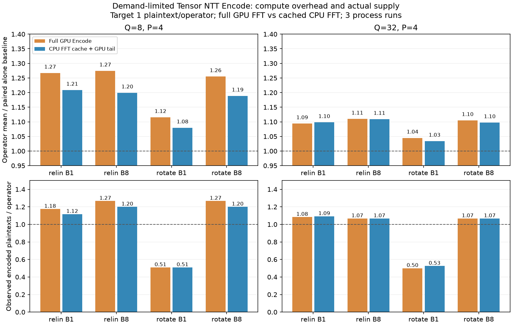
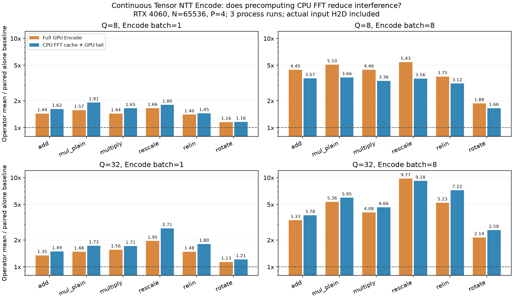

# CPU 预存 FFT 系数对前台算子的影响（2026-10-11）

结论：预存 FFT 可以减少 GPU Encode 的工作，但并不自动减少前台干扰。在相同一份明文/算子的需求速率下，Q=8 的前台耗时相对完整 GPU Encode 降低约 3%–6%（进程内配对比值的中位数）；Q=32 的差异大多约 1% 或更小，relinearize batch=1 的三个进程方向不一致。持续满速提交时，缓存路径往往产出更多 RNS/NTT 工作，前台开销反而可能上升。尚未实现零减速。

## 测量范围

RTX 4060 Laptop、N=65536、Q=8/32、P=4、30-bit primes、scale=2^40、64 MiB 初始 RMM pool。源码提交 `9064e856`。188Server 连接返回 SOCKSv5 Host unreachable，本轮仅测本机。主算子使用真实 GpuEvaluator add/multiply_plain/multiply/rescale/relinearize/rotate API，NTT 为 CUDA four-step，内部 scratch 和分配计时。参数用于算术实验（sec_level_none）。

两条输入路径在同一进程中、使用同一 NTT 后端比较：

- 完整 GPU Encode：pinned 原始 FP64 slots H2D → 排列 → FP64 cuFFT → 旋转因子/缩放/舍入/RNS → NTT。
- CPU FFT 缓存：CPU 初始化时用 Poseidon DWTHandler 和 gen=5 槽位排列完成归一化逆嵌入，仅缓存 N 个未缩放、未舍入的 FP64 实系数。运行时：pinned 系数 H2D → GPU 缩放/舍入/RNS → 同一 NTT。CPU FFT 不在运行时或前台计时窗口执行。

Tensor 后端是 TileLang INT8 NTT：前三个四级融合 TAM 的矩阵乘使用 Tensor Core，余下四级使用 CUDA 尾部 kernel；拆位、重组、模约减仍使用普通指令。没有 Tensor FFT，也没有降低浮点精度。CUDA 后端是原有 four-step NTT。

缓存每份 512 KiB，原始满槽 FP64 输入每份 256 KiB；实际上传也由 256 KiB 增至 512 KiB，计入所有正式结果。batch=8 分别占 4 MiB/2 MiB。CPU FFT 的临时复数工作区/根表不为每份权重永久缓存；实验为公平比较同时保留两个 source buffers。FFT plans、持久缓冲、密钥/操作数上传均在计时之外。

每配置三个独立进程；前台/后台预热各至少 100 ms GPU event 时间，30 个样本，每样本 4 次算子调用。前后两次独立基线夹住打乱顺序的后台路径。每进程 seed 不同，保存在 JSON 中。表中 mean slowdown 为后台时算子平均 GPU event 耗时除以前后基线平均值，再取三个进程的中位数；每个模式的 wall、median、p95 和按顺序的样本也保存。CUDA event 包含主机提交间隙，GPU 时钟未锁定。

前台和编码各自使用独立 CUDA per-thread stream，所有进程检查 stream IDs 不同；本机 IDs 为 13/14。同一 GPU、默认优先级。CPU 缓存只读，GPU 输入/输出不与前台共享。

## 同一需求速率：一份明文/重算子

`demand/` 只测 relinearize/rotate，后台均使用 TileLang Tensor NTT。每批目标周期为 `batch * alone_before.operator.mean_ms`；两条输入路径使用完全相同的目标周期，编码线程每批完成后适当 sleep。

| Q | Batch | 前台算子 | 完整 GPU Encode：平均耗时增加 | CPU FFT 缓存：平均耗时增加 | 完整路径产出（份/算子） | 缓存路径产出（份/算子） |
| ---: | ---: | --- | ---: | ---: | ---: | ---: |
| 8 | 1 | relinearize | 26.7% | 20.9% | 1.175 | 1.117 |
| 8 | 1 | rotate | 11.5% | 8.0% | 0.508 | 0.508 |
| 8 | 8 | relinearize | 27.5% | 19.9% | 1.267 | 1.200 |
| 8 | 8 | rotate | 25.5% | 18.9% | 1.267 | 1.200 |
| 32 | 1 | relinearize | 9.4% | 9.8% | 1.083 | 1.092 |
| 32 | 1 | rotate | 4.5% | 3.4% | 0.500 | 0.525 |
| 32 | 8 | relinearize | 11.0% | 10.9% | 1.067 | 1.067 |
| 32 | 8 | rotate | 10.5% | 9.7% | 1.067 | 1.067 |



Q=8 的改善在三个进程内的直接配对比较中均同向，主算子平均耗时相对完整 GPU Encode 约降低 3%–6%（进程内配对比值的中位数）。Q=32 的 relinearize batch=1 几乎不变，三个配对比值为约 0.995/1.004/1.005；不能将小幅波动宣称为明显收益。配对比值与每进程数据见 `analysis.json`。

缓存路径的 rotate batch=1 仍只产出约 0.51（Q=8）/0.53（Q=32）份/算子，未满足目标。其余表中配置的汇总产出达到一份/算子，但没有证明真实消费者的所有 deadline。产出是前台 wall-time 窗口内实际完成的明文，窗口边界不确定性为一批（batch=8、120 次调用时约 0.067 份/算子）。前台使用独立、预先就位的操作数，没有等待这些新明文；供给不足意味着实际流水线可能 stall。编码错误标志的 CPU 读取在 GPU event 时间之外，但属于实际后台产出循环开销。

## 持续满速提交：六种算子

`continuous/` 不限速，比较四条路径（完整/缓存 × CUDA/Tensor NTT）。下表聚焦 Tensor NTT；CUDA 结果和全部时延样本保存在 `continuous/summary.json` 及各原始报告中。

| Q | Batch | 前台算子 | 完整 GPU Encode：mean slowdown | CPU FFT 缓存：mean slowdown | 完整路径产出（份/算子） | 缓存路径产出（份/算子） |
| ---: | ---: | --- | ---: | ---: | ---: | ---: | ---: |
| 8 | 1 | add | 1.440× | 1.619× | 0.083 | 0.125 |
| 8 | 1 | multiply | 1.436× | 1.650× | 0.142 | 0.250 |
| 8 | 1 | multiply_plain | 1.571× | 1.912× | 0.108 | 0.200 |
| 8 | 1 | relinearize | 1.401× | 1.449× | 2.000 | 3.000 |
| 8 | 1 | rescale | 1.657× | 1.804× | 0.733 | 1.083 |
| 8 | 1 | rotate | 1.156× | 1.161× | 0.750 | 1.017 |
| 8 | 8 | add | 4.451× | 3.574× | 0.467 | 0.400 |
| 8 | 8 | multiply | 4.457× | 3.357× | 0.733 | 0.733 |
| 8 | 8 | multiply_plain | 5.104× | 3.661× | 0.533 | 0.467 |
| 8 | 8 | relinearize | 3.746× | 3.123× | 12.000 | 12.000 |
| 8 | 8 | rescale | 5.426× | 3.559× | 3.600 | 2.800 |
| 8 | 8 | rotate | 1.877× | 1.657× | 4.000 | 4.000 |
| 32 | 1 | add | 1.346× | 1.486× | 0.117 | 0.167 |
| 32 | 1 | multiply | 1.556× | 1.710× | 0.242 | 0.333 |
| 32 | 1 | multiply_plain | 1.477× | 1.726× | 0.225 | 0.333 |
| 32 | 1 | relinearize | 1.477× | 1.803× | 5.775 | 10.000 |
| 32 | 1 | rescale | 1.949× | 2.705× | 1.000 | 2.000 |
| 32 | 1 | rotate | 1.134× | 1.213× | 1.675 | 2.750 |
| 32 | 8 | add | 3.329× | 3.784× | 0.933 | 1.133 |
| 32 | 8 | multiply | 4.075× | 4.656× | 1.800 | 2.267 |
| 32 | 8 | multiply_plain | 5.356× | 5.951× | 1.600 | 2.000 |
| 32 | 8 | relinearize | 5.229× | 7.224× | 44.000 | 71.400 |
| 32 | 8 | rescale | 9.771× | 9.184× | 8.000 | 8.000 |
| 32 | 8 | rotate | 2.139× | 2.580× | 12.000 | 17.933 |



Q=32、batch=1 时，relinearize 的 mean slowdown 从约 1.48× 增至 1.80×，实际产出从约 5.8 增至 10.0 份/算子。移除 FFT 后后台可以更频繁地产生 RNS/NTT 工作，所以持续满速时不应期待干扰自动下降。高产出也可能包含前台被拖慢后窗口变长的贡献；应结合限速模型判断。

## 独立编码尾部及预处理成本

每份报告在前台干扰测试之外也测四条独立路径：各至少 100 ms GPU event 预热、30 个样本。下表来自 `continuous/`，单位 ms/份，包含实际输入 H2D；CPU FFT 只在初始化执行，不包含在缓存路径的运行时间中。

| Q | Batch | 完整 CUDA Encode | CPU FFT + CUDA 尾部 | 完整 Tensor Encode | CPU FFT + Tensor 尾部 |
| ---: | ---: | ---: | ---: | ---: | ---: |
| 8 | 1 | 0.1568 | 0.1048 | 0.2052 | 0.1525 |
| 8 | 8 | 0.1127 | 0.0838 | 0.1580 | 0.1294 |
| 32 | 1 | 0.2809 | 0.2895 | 0.4893 | 0.4195 |
| 32 | 8 | 0.2612 | 0.2338 | 0.6578 | 0.5226 |

Tensor 路径独立运行时间约缩短 14%–26%；CUDA 路径 Q=32、batch=1 的汇总值略变慢，不能假设所有配置都获得独立时延收益。未锁时钟，单次路径存在波动。CPU 预处理约 0.7–1.7 ms/份，包含一次根表/工作区分配，只是 setup 记录，未作为重复预热 CPU FFT 基准；完整记录在 `encode_preparation` 字段。

## 正确性与复现

24 份正式报告全部成功。CPU FFT 缓存路径的所有明文与 CPU Encode 的全部 RNS residues 精确一致，最大输入解码误差约 3.052e-10。完整 GPU Encode 也做 CPU 解码检查，FFT 舍入产生的 CPU residues 差异显式记录。所有 NTT 后端和后台完成批次要求与各自输入路径的 canonical CUDA 输出逐元素一致。前台所有算子在独立/并发后要求 CPU 元数据和全部 RNS coefficients 一致。NaN/系数越界拒绝检查通过。

并发 Q=3、batch=2 的 compute-sanitizer memcheck 得到 0 errors，见 `memcheck.log`；Encode CTest 通过，见 `ctest.log`。smoke/memcheck 使用随机顺序参数改动前的等价算术代码，正式报告使用提交 `9064e856`。`analyze_results.py` 检查 24 份报告、缓存大小、正确性、样本数、供给计数和相同目标周期，并生成进程内配对比较。

这是内存中固定权重缓存的实验，没有包括动态激活的运行时 CPU FFT、文件 I/O、大模型缓存 miss、bootstrap、多卡或 Qwen 端到端消费轨迹。生产 prefetch runtime 未修改。它支持把静态 FFT 移到预处理，但不支持“Tensor Core 空闲就能免费编码”的假设；仍需控制后台提交量并同时检查供给率和前台开销。

源代码和构建选项见 [benchmark README](../../src/poseidon/tests/gpu_encode/README.md)。`environment.json` 保存代码版本、二进制 SHA-256 和编译架构；Poseidon 为原有 sm_75+PTX，TileLang 为 sm_89。`continuous-run.log` / `demand-run.log` 记录三轮配置顺序。图可由 `plot_results.py` 重建。

```sh
python3 scripts/benchmark_gpu_encode_contention.py \
  --binary build-runtime-gpu-api-release/bin/poseidon_gpu_encode_contention_bench \
  --output test-results/gpu-encode-cpu-fft-continuous-new \
  --runs 3 --repeat 30 --burst 4 --compare-cpu-fft
python3 scripts/benchmark_gpu_encode_contention.py \
  --binary build-runtime-gpu-api-release/bin/poseidon_gpu_encode_contention_bench \
  --output test-results/gpu-encode-cpu-fft-demand-new \
  --runs 3 --repeat 30 --burst 4 --compare-cpu-fft --demand-only
python3 test-results/gpu-encode-cpu-fft-local-20261011/analyze_results.py
python3 test-results/gpu-encode-cpu-fft-local-20261011/plot_results.py
```
